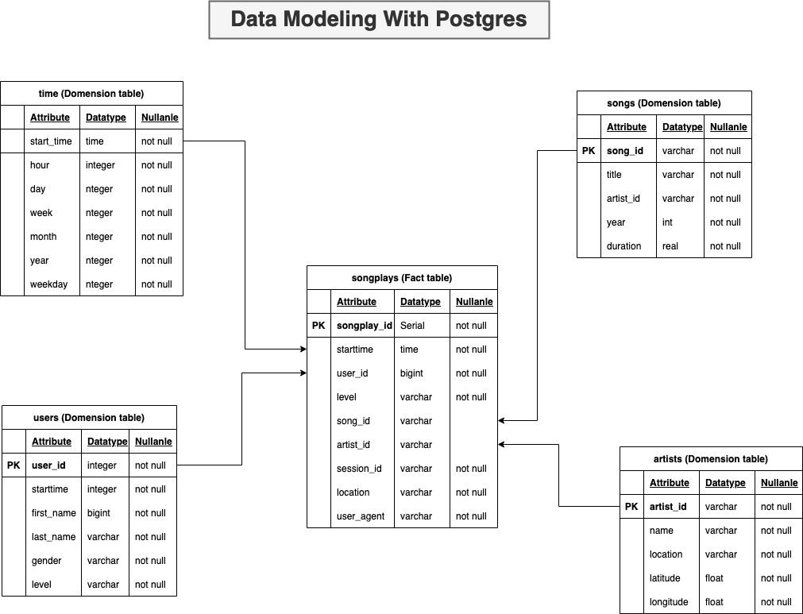

# Project: Data Modeling With Postgres

Songs and user acitvity needs to be analysed to understand what songs users are listening to. 
The usage data is captured and stored in JSON format. ETL pipeline needs to be built to ingest the data into Postgres database.
The data model needs to be designed to optmise the query performance of the aggregations performing calaulations and clustering of the data.


## Data Source

The data for song and users actinity log is stored in two directories respectively
1. data/song_data
2. data/log_data

## Data format

### song data
```json
{
    "num_songs": 1,
    "artist_id": "ARC43071187B990240",
    "artist_latitude": null,
    "artist_longitude": null,
    "artist_location": "Wisner, LA",
    "artist_name": "Wayne Watson",
    "song_id": "SOKEJEJ12A8C13E0D0",
    "title": "The Urgency (LP Version)",
    "duration": 245.21098,
    "year": 0
}
```
### users log data
```json
{
    "artist": null,
    "auth": "Logged In",
    "firstName": "Walter",
    "gender": "M",
    "itemInSession": 0,
    "lastName": "Frye",
    "length": null,
    "level": "free",
    "location": "San Francisco-Oakland-Hayward, CA",
    "method": "GET",
    "page": "Home",
    "registration": 1540919166796.0,
    "sessionId": 38,
    "song": null,
    "status": 200,
    "ts": 1541105830796,
    "userAgent": "\"Mozilla\/5.0 (Macintosh; Intel Mac OS X 10_9_4) AppleWebKit\/537.36 (KHTML, like Gecko) Chrome\/36.0.1985.143 Safari\/537.36\"",
    "userId": "39"
}
```
## Data model and tables


## Project files

The project files and folders in this repository are

- <b>data/</b> : The directory contains two folders log_data and song_data. These directories contains all the source data for the user song play activity log in the json format and song and artist data in data in json format.

- <b>sql_queries.py</b> : This is a script file contaiing all the SQL commands to DROP, CREATE and INSERT values in the tables

- <b>create_tables.py</b> : This script file connects to the postgres database and executes the sql queries in <b>sql_queries.py</b> to drop, recreate and insert data into the tables.

- <b>etl.py </b> : The script file connects to the postgres database and extracts, transforms and loads the data into the dimension and fact tables. 

- <b>etl.ipynb</b> : This jupyter notebook used to build and test the data extraction, transformation and loading before implementing them in <b>etl.py</b>.

- <b>test.ipynb</b> : This jupyter notebook is used to test the data loaded into the respective tables

## Conclusion
 Execution prcess 
 In the python console excute 
- create_tables.py
- etl.py
- test.ipynb to test the results
